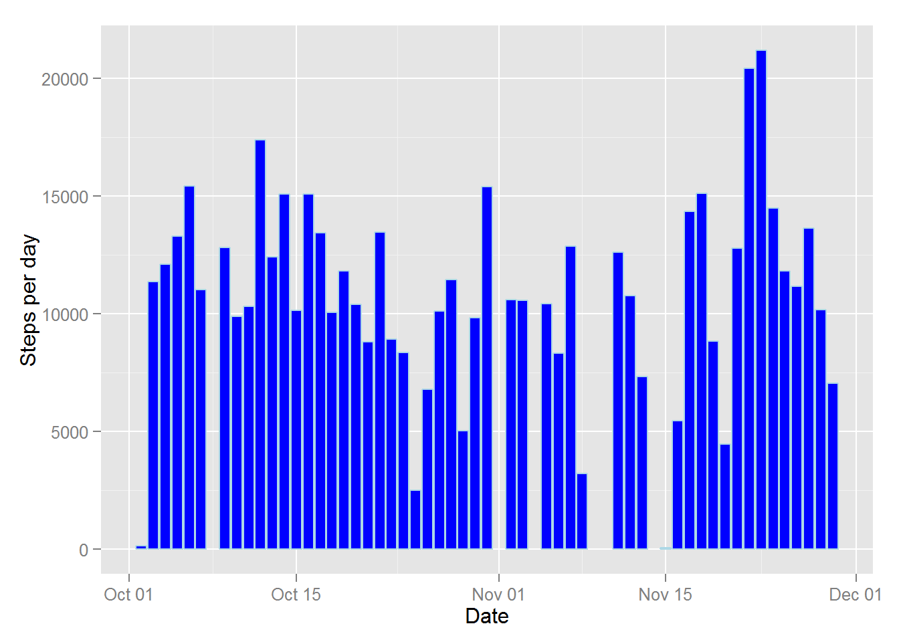
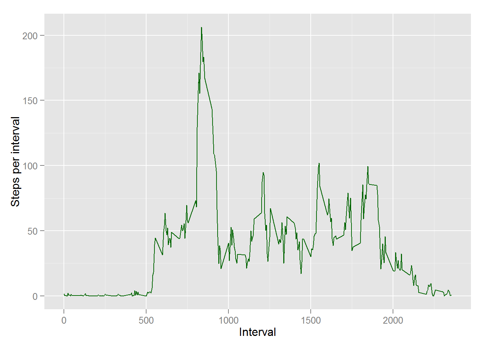
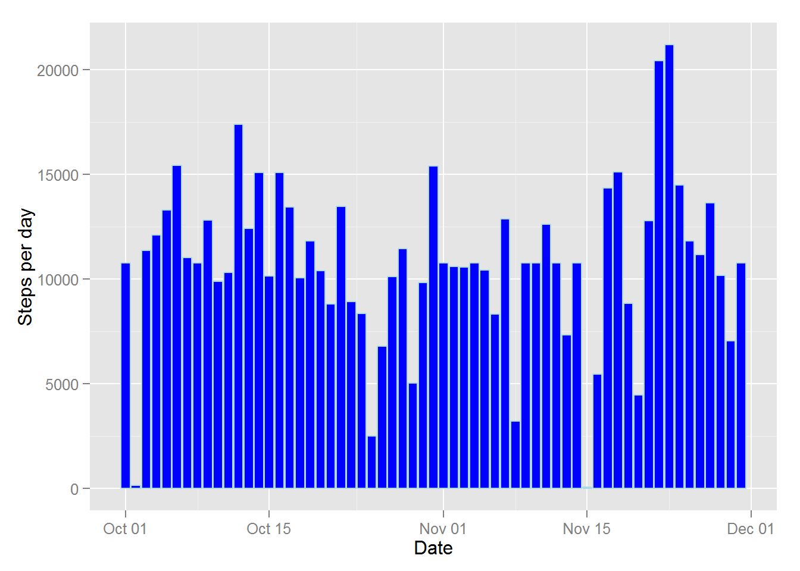

---
title: "Activity monitoring analysis"
author: "Wojtek Malinowski"
date: "Friday, August 15, 2014"
output: html_document
--- 

This is an R Markdown document for Peer Assessment no 1 from Coursera class [Reproducible Research](https://www.coursera.org/course/repdata) by Roger D. Peng, PhD, Jeff Leek, PhD, Brian Caffo, PhD. This document uses  ggplot2 library for plot display.


```r
  library('ggplot2')
  # set locale for english dates
  Sys.setlocale("LC_TIME", "English")
```

## Data

The data for this assignment can be downloaded from the course web site:

**Dataset**: [Activity monitoring data](https://d396qusza40orc.cloudfront.net/repdata%2Fdata%2Factivity.zip) [52K]
The variables included in this dataset are:

**steps**: Number of steps taking in a 5-minute interval (missing values are coded as NA)

**date**: The date on which the measurement was taken in YYYY-MM-DD format

**interval**: Identifier for the 5-minute interval in which measurement was taken

The dataset is stored in a comma-separated-value (CSV) file and there are a total of 17,568 observations in this dataset. And is downloaded and read as follows:


```r
  if(!file.exists("activity.csv")) {
    url = 'https://d396qusza40orc.cloudfront.net/repdata%2Fdata%2Factivity.zip'
    filename = 'activity.zip'
    download.file(url, filename, mode ='wb') 
    # extract files
    unzip(filename)
  }
  activity = read.table("activity.csv", sep = ",", na.strings = "NA", header = TRUE)
  activity$date = as.Date(activity$date, format = "%Y-%m-%d")
```

## Analysis

### What is mean total number of steps taken per day?


```r
  q1 = aggregate(activity$steps ~ activity$date,  FUN = sum)
  names(q1) = c('date', 'steps')
  g = ggplot(q1, aes(date, steps))
  g + geom_bar(stat="identity", fill="blue", colour="lightblue") + labs(y = "Steps per day", x = "Date")
```

 

```r
  meanStepsPerDay = mean(q1$steps)
  medianStepsPerDay = median(q1$steps)
```
Mean steps per day =  10766.19 while the median = 10765
  
### What is the average daily activity pattern?


```r
  q2 = aggregate(activity$steps ~ activity$interval,  FUN = sum)
  names(q2) = c('interval', 'steps')
  g = ggplot(q2, aes(interval, steps))
  g + geom_line(colour="darkgreen") + labs(y = "Steps per interval", x = "Interval")
```

 

```r
  maxStepsInterval = q2$interval[which.max(q2$steps)]
  # calculate end of interval 
  if(maxStepsInterval %% 100 == 55) {
    maxStepsIntervalEnd = maxStepsInterval + 45
  } else {
    maxStepsIntervalEnd = maxStepsInterval + 5
  }
```
The interval with maximum number of steps starts at: 835h and finishes at 840h

### Imputing missing values
Steps missing values are replaced by a mean from corresponding 5 minute interval through all days.


```r
  activityNoNA = activity
  i = which(is.na(activityNoNA$steps))
  tmp = ave(activityNoNA$steps, activityNoNA$interval, FUN = function(x) mean(x, na.rm = TRUE))
  activityNoNA$steps[i] = tmp[i]
  q3 = aggregate(activityNoNA$steps ~ activityNoNA$date,  FUN = sum)
  names(q3) = c('date', 'steps')
  g = ggplot(q3, aes(date, steps))
  g + geom_bar(stat="identity", fill="blue", colour="lightblue") + labs(y = "Steps per day", x = "Date")
```

 

```r
  meanStepsPerDayNoNA = mean(q3$steps)
  medianStepsPerDayNoNA = median(q3$steps)
```
Mean steps per day =  10766.19 while the median =  10766.19


### Are there differences in activity patterns between weekdays and weekends?


